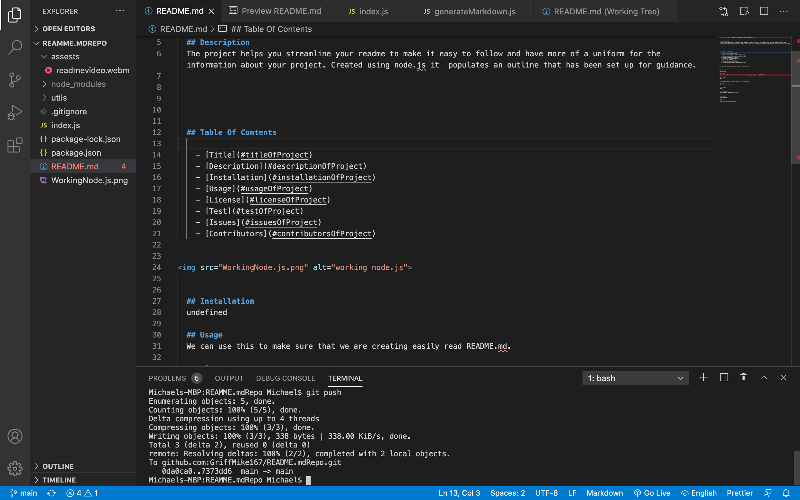

  <h1 align="center">README.md Generator using Node.js</h1>

  ## Description
  The project helps you streamline your readme to make it easy to follow and have more of a uniform for the information about your project. Created using node.js it  populates an outline that has been set up for guidance.
  
  <video src="readmevideo.webm" width="640" height="480">

  ## Table Of Contents
    - [Description](#descriptionOfProject)
    - [Installation](#installationOfProject)
    - [Usage](#usageOfProject)
    - [License](#licenseOfProject)
    - [Test](#testOfProject)
    - [Issues](#issuesOfProject)
    - [Contributors](#contributorsOfProject)

  ## Installation
  undefined

  ## Usage
  We can use this to make sure that we are creating easily read README.md.

  ## License
  MIT

  This application is covered by the MIT license.

  ## Test
  No test were included.

  ## Issues
  N/A

  ## Contributors
  Just myself, Michael Griffith.

  # Github
  GriffMike167

  # Email
  griffithcmichael@gmail.com

